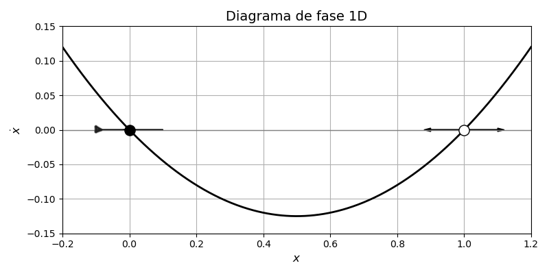
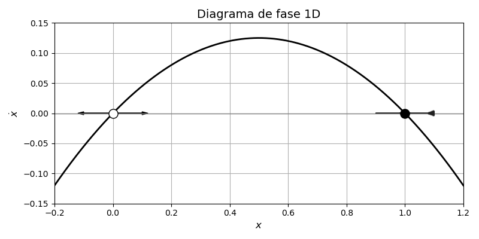
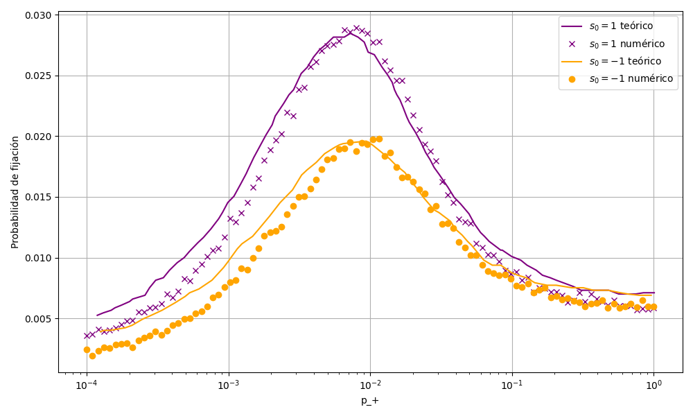
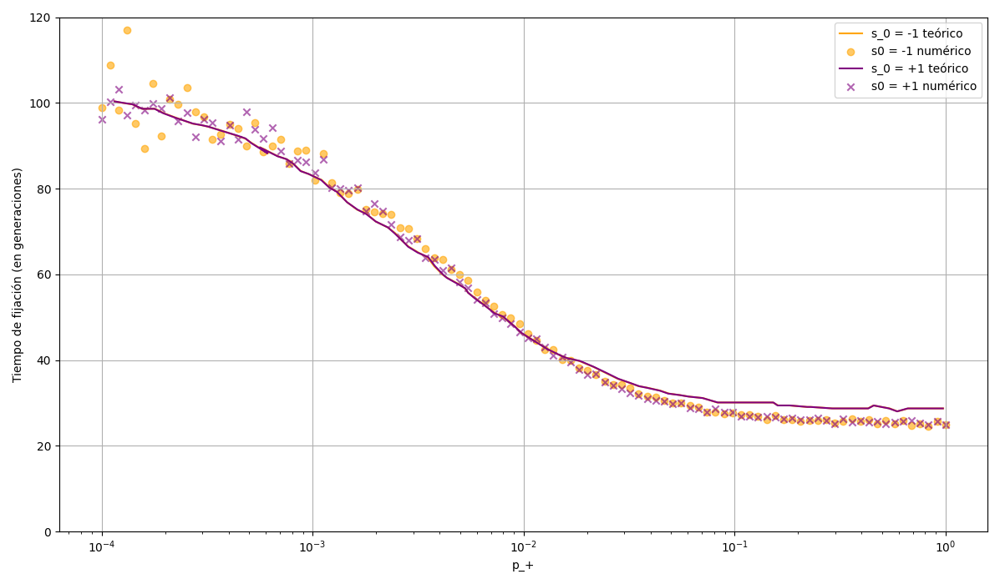
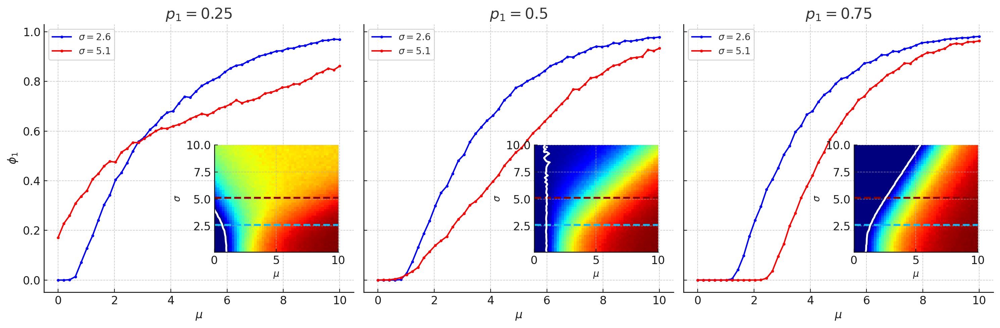
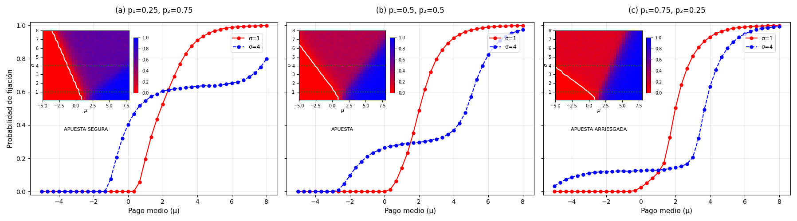

# Stochastic Evolutionary Game Theory — Environmental Switching

Simulation of evolutionary dynamics in a finite population with environmental fluctuations. Two strategies compete under stochastic fitness-based selection (Moran process) in a randomly switching environment. Includes fixation probability and fixation time analysis with environmental effects.

---

## Repository layout

```
.
├── scripts/
│   ├── fixation_probability.py         # Moran process simulation (Numba-accelerated)
│   ├── generate_plots.py               # Sweep parameters and reproduce result figures
│   └── utils.py                        # Shared utility functions
├── figures/                            # PNG outputs
│   ├── fixation_probability.png
│   ├── fixation_time.png
│   ├── diagram_negative.png
│   ├── diagram_positive.png
│   ├── figure_analysis1.png
│   └── figure_analysis2.png
├── latex/
│   ├── sorsamp.tex                     # Spanish LaTeX source
│   ├── aipsamp.bib                     # Bibliography
│   └── *.png / *.eps                   # LaTeX figures
├── MemoryEN.pdf
├── MemoriaES.pdf
└── README.md
```

---

## Report

The full academic report is available in two languages:

| File | Description |
|------|-------------|
| [MemoryEN.pdf](MemoryEN.pdf) | English version — stochastic Moran process, environmental switching, fixation probability and time analysis |
| [MemoriaES.pdf](MemoriaES.pdf) | Spanish version (original) |

The LaTeX sources are in the [`latex/`](latex/) folder together with the bibliography.

---

## Physical Model

The system consists of a finite population of $N$ individuals playing an evolutionary game in a randomly switching environment. The environment switches between two states ($\sigma = +1$ and $\sigma = -1$) with rates $p_+$ and $p_-$.

### Payoff Matrix

|  | A | B |
|--|---|---|
| A | 1 | $1 + 0.5\sigma$ |
| B | $1 + 0.9\sigma$ | 1 |

The fitness of each strategy depends on the population composition and the environment.

### Evolutionary Dynamics

The population evolves via a **Moran process** with fitness-dependent reproduction and selection intensity $\beta$:

- Each generation: one individual is selected to reproduce with probability proportional to $e^{\beta \pi_i}$ (fitness)
- A random individual dies, replaced by the offspring
- The population size $N$ remains constant

## Methods

### Pure Evolutionary Dynamics — `fixation_probability.py`

Simulates:
- Environmental switching (stochastic)
- Fitness calculation based on payoff matrix
- Moran process (birth-death dynamics)
- Measures fixation probability and time

**Key parameters:**
- `N` — population size
- `beta` — selection strength (inverse temperature)
- `p_plus` — switching rate from $\sigma = +1 \to \sigma = -1$
- `p_minus` — switching rate from $\sigma = -1 \to \sigma = +1$

**Computational speedup:**
- Numba JIT compilation (`@jit(nopython=True)`)
- Parallel realizations (`@jit(..., parallel=True)` with `prange`)
- ~100-1000× speedup vs. pure Python

## Results

### Probability of Fixation Under Environmental Switching

The simulations explore how environmental switching rates affect the fixation probability of the mutant strategy. The results below show both the probability and time-to-fixation as functions of the switching rate $p_+$.

**Environment phase diagram (σ₀ = -1):**



**Population dynamics (σ₀ = +1):**



### Simulation Results

#### Fixation Probability vs $p_+$

Shows how the probability of mutant strategy fixation depends on environmental switching rate.



#### Average Fixation Time vs $p_+$

Displays the average time (in generations) for mutant fixation across different switching rates.



#### Additional Analysis

Extended analysis figures showing phase diagrams and convergence behavior across different parameter regimes:

<div align="center">
  




</div>


## Requirements

```
numpy
numba
matplotlib
```

Install with:
```bash
pip install numpy numba matplotlib
```

## Usage

### Single Run — prints fixation probability and saves plots

```bash
python scripts/fixation_probability.py
```

Output:
- Console: fixation probability and average fixation time
- `figures/fixation_probability.png` — fixation probability sweep
- `figures/fixation_time.png` — fixation time sweep
- `figures/fixation_results.npz` — raw data (NumPy format)

### Full Parameter Sweep — reproduce all result figures

```bash
python scripts/generate_plots.py
```

This sweeps multiple parameters and generates publication-quality figures.

### Key Parameters (in scripts)

| Parameter | Default | Description |
|-----------|---------|-------------|
| `N` | 50 | Population size |
| `beta` | 0.5 | Selection strength |
| `p_minus` | 0.01 | Switching probability $p_- \to +1$ |
| `n_realizations` | $10^3$ | Realizations per parameter set |
| `n_gens` | $10^3$ | Generations per realization |

Modify these at the top of each script before running.

## Performance

- **Pure Python:** ~10-20 seconds per $p_+$ value (100 realizations)
- **Numba JIT:** ~0.1-0.2 seconds per $p_+$ value
- **Speedup:** ~100-200×

All simulations use parallel numba with OpenMP (auto-detected cores).

## References

See [`latex/`](latex/) for the full academic report (Spanish original) with LaTeX sources and bibliography.

---

## Author

**A. S. Amari Rabah**

Developed as part of the coursework for *Physics of Complex Systems* —
Bachelor's Degree in Physics, University of Granada, Spain.


---

**Note:** The simulation accounts for finite-population effects, stochastic environmental switching, and strategy-dependent fitness. The results can be compared against mean-field predictions and analytical solutions when available.
